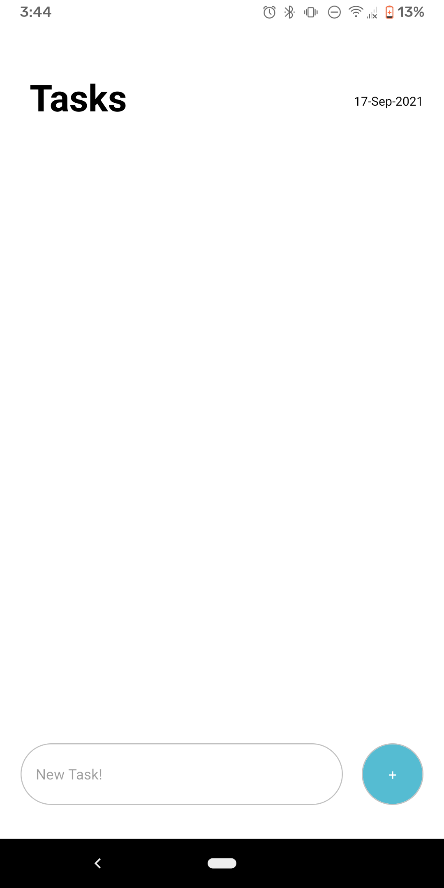
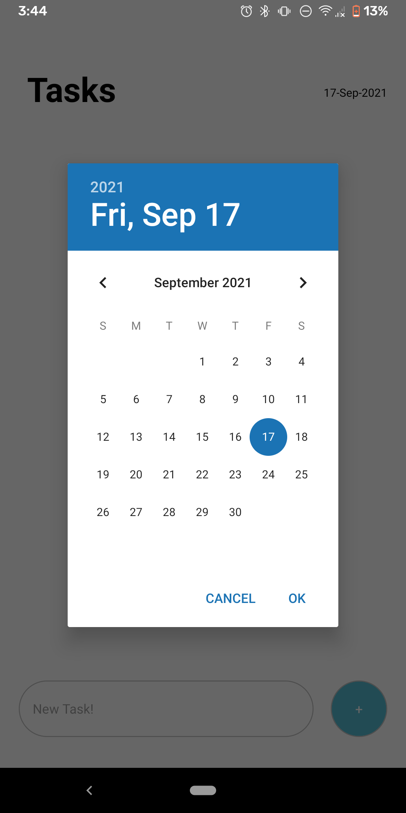
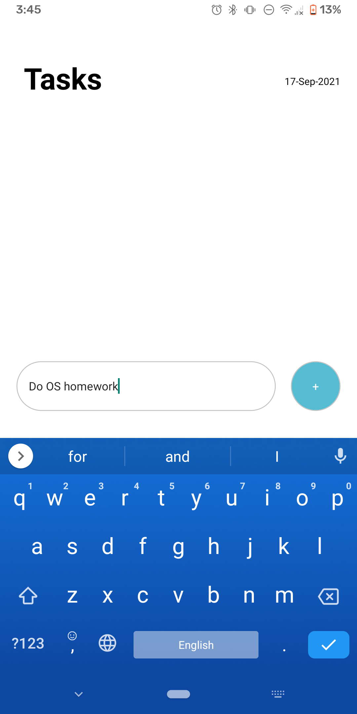
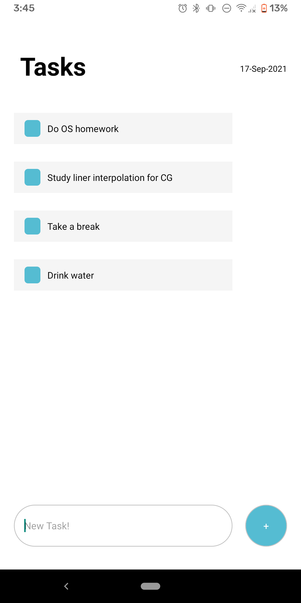
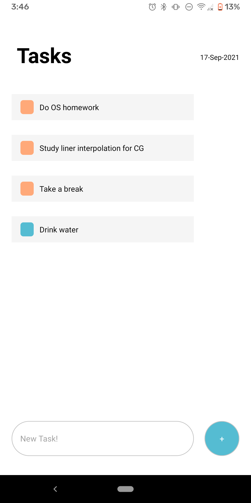

# Task Manager

## Introduction
This app is a simple task management app developped on React native app. The can be run either on Android, IOS, or Web Browser. 
It allows a user to selct any date and simply add tasks to the date. After that a user would be able to mark tasks complete just by clicking on it 
or a user could delete a task by long pressing on it. The app is designed to be simple for a user: no login required, no internet required, no big cpu time required, simple.

## Home page
the app's home page looks like this. Simple.

## Load the calender by clicking on the date on the top right cornor

## typing a task

# A List of tasks

# Marking a task complete by clicking on them

